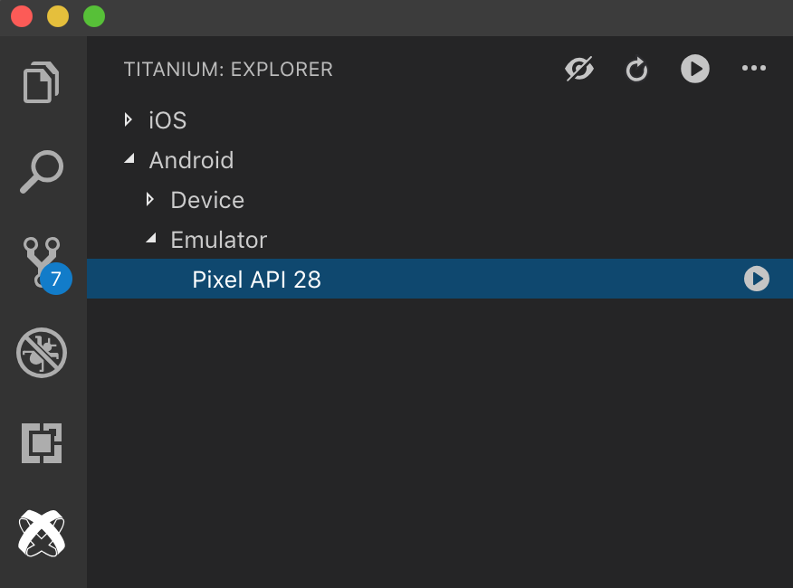

# Titanium Package for Visual Studio Code

Titanium build tools and editor additions for [Visual Studio Code](https://code.visualstudio.com).

## Installation

### Via the browser

1. [Open the extension on the Visual Studio Marketplace](https://marketplace.visualstudio.com/items?itemName=tidev.titanium-sdk)
2. Click "Install"

### In VS Code

1. Open the Extension view, type in Titanium
2. Select the "Titanium" extension by TiDev
3. Click "Install"
4. Reload VS Code

## Features

### Commands

This extension makes the following commands available in the Command Palette to enhance your development experience.

| Command | Description | Keybinding |
| ------- | ----------- | ---------- |
| `Titanium: Create application` | Create a new Titanium application project | - |
| `Titanium: Create keystore` | Create keystore | - |
| `Titanium: Create module` | Create a new Titanium module project | - |
| `Titanium: Enable LiveView` | Enable LiveView | - |
| `Titanium: Disable LiveView` | Disable LiveView | - |
| `Titanium: Build` | Build a Titanium project |  Mac: <kbd>cmd</kbd>+<kbd>alt</kbd>+<kbd>enter</kbd>   Windows/Linux: <kbd>ctrl</kbd>+<kbd>alt</kbd>+<kbd>enter</kbd> |
| `Titanium: Package` | Package a Titanium project | - |
| `Titanium: Stop` | Stop a running build or package process |  Mac: <kbd>cmd</kbd>+<kbd>alt</kbd>+<kbd>.</kbd>   Windows/Linux: <kbd>ctrl</kbd>+<kbd>alt</kbd>+<kbd>.</kbd> |
| `Titanium: Set log level` | Set log level | - |
| `Titanium: Generate Alloy controller` | Generate Alloy controller | - |
| `Titanium: Generate Alloy migration` | Generate Alloy migration | - |
| `Titanium: Generate Alloy model` | Generate Alloy model | - |
| `Titanium: Generate Alloy style` | Generate Alloy style | - |
| `Titanium: Generate Alloy view` | Generate Alloy view | - |
| `Titanium: Generate Alloy widget` | Generate Alloy widget | - |
| `Titanium: Open related view` | Open related view |  Mac: <kbd>cmd</kbd>+<kbd>alt</kbd>+<kbd>v</kbd>   Windows/Linux: <kbd>ctrl</kbd>+<kbd>alt</kbd>+<kbd>v</kbd> |
| `Titanium: Open related style` | Open related style |  Mac: <kbd>cmd</kbd>+<kbd>alt</kbd>+<kbd>s</kbd>   Windows/Linux: <kbd>ctrl</kbd>+<kbd>alt</kbd>+<kbd>s</kbd> |
| `Titanium: Open related controller` | Open related controller |  Mac: <kbd>cmd</kbd>+<kbd>alt</kbd>+<kbd>x</kbd>   Windows/Linux: <kbd>ctrl</kbd>+<kbd>alt</kbd>+<kbd>x</kbd> |
| `Titanium: Open related files` | Open related files |  Mac: <kbd>cmd</kbd>+<kbd>alt</kbd>+<kbd>a</kbd>   Windows/Linux: <kbd>ctrl</kbd>+<kbd>alt</kbd>+<kbd>a</kbd> |
| `Titanium: Fix environment issues` | Fix environment issues | - |
| `Titanium: Check For Updates` | Check For Updates | - |
| `Titanium: Install All Updates` | Install All Updates | - |
| `Titanium: Select Updates` | Select Updates | - |
| `Titanium: Clean project` | Clean project | - |

### Titanium View

This extension provides a `Titanium` view to the Activity Bar in VS Code. With this view, you can view your available build platform and their targets.

Access to the same commands provided by the Command Palette are available inline on device and platform targets, as well as in the right click context menu

### Debugging

This extension allows you to debug Titanium applications using the debugger in VS Code. For more information view the [debugging documentation](./doc/debugging.md).

### Tasks

This extension contributes [tasks](https://code.visualstudio.com/docs/editor/tasks#_custom-tasks) allowing you to customize and orchestrate your own builds. View the [task documentation](./doc/tasks.md) for more information.

## Configuration Settings

There are a variety of settings that you can use to customize this extension to your needs. You can find them listed below.

You can learn more about User and Workspace settings in the [VS Code documentation](https://code.visualstudio.com/docs/getstarted/settings).

| Setting name | Description | Default Value |
| -------------| ------------| ------------- |
| `titanium.android.keystoreAlias` | Keystore alias used for packaging Android applications | `No Default` |
| `titanium.android.keystorePath` | Path to keystore used for packaging Android applications | `No Default` |
| `titanium.build.liveview` | Whether to enable LiveView when building applications | `true` |
| `titanium.codeTemplates.jsFunction` | Event handler function template | `\nfunction ${text}(e){\n}\n` |
| `titanium.codeTemplates.tssClass` | Style class (.) template | `\n'.${text}': {\n}\n` |
| `titanium.codeTemplates.tssId` | Style ID (#) template | `\n'#${text}': {\n}\n` |
| `titanium.codeTemplates.tssTag` | Style tag template | `\n'${text}': {\n}\n` |
| `titanium.general.defaultCreationDirectory` | Default directory to use when creating projects | `No Default` |
| `titanium.general.displayBuildCommandInConsole` | The executed build command is written to the output channel to aid debugging. This will include password arguments. | `true` |
| `titanium.general.logLevel` | Logging level for commands being run | `info` |
| `titanium.general.updateFrequency` | Controls the frequency for how often to show an alert if there are updates available. Updates can always be viewed in the Titanium activity pane. Accepts values in time formats like 60 minutes, 12 hours, 7 days etc. | `1 day` |
| `titanium.general.useTerminalForBuild` | When true build/package commands will be run using the integrated terminal as opposed to using an output channel. | `true` |
| `titanium.package.distributionOutputDirectory` | Output directory for package builds. | `dist` |
| `titanium.project.defaultI18nLanguage` | Default language to use for i18n autocomplete. | `en` |
| `titanium.ios.organizations` | Input JSON object with your organization's names and IDs.  | `No Default` |

## Snippet definitions

### Snippets for Titanium development

| Prefix | Description |
| ------ | ----------- |
| `tidebug` | Debug log function |
| `tiinfo` | Info log function |
| `titrace` | Trace log function |
| `tiwarn` | Warn log function |
| `tierror` | Error log function |
| `tiaddevent` | Add event listener function |
| `tiremevent` | Remove event listener function |
| `tifireevent` | Fire event function |
| `tialert` | Create alert dialog |
| `tiopt` | Create option dialog |
| `tianim` | Create animation |
| `tifile` | Get file |
| `tisound` | Create sound |
| `tiaudio` | Create audio player |
| `tivideo` | Create video player |
| `ticamera` | Show camera |

### Snippets for Alloy development

| Prefix | Description |
| ------ | ----------- |
| `alglo` | Alloy Globals object |
| `alcfg` | Alloy CFG object |
| `alargs` | Arguments available in an Alloy controller  |
| `alcon` | Alloy create controller function |
| `alcol` | Alloy create collection function |
| `almod` | Alloy create model function |
| `alwid` | Alloy create widget function |
| `ifios` | Alloy iOS conditional statement |
| `ifand` | Alloy Android conditional statement |
| `ifwin` | Alloy Windows conditional statement |

## Contributing

See the [contributing guide](./CONTRIBUTING.md) for info

## License

[Apache License. Version 2.0](LICENSE.md)
