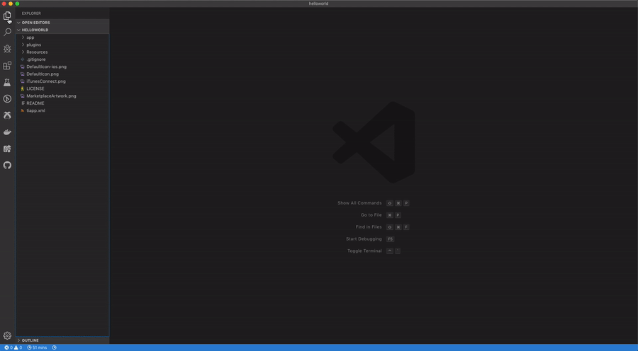
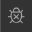
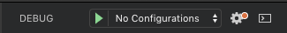
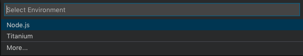
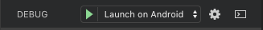

# Debugging Titanium applications

## Prerequisites

* To debug an application on iOS you must install [ios-webkit-debug-proxy](https://github.com/google/ios-webkit-debug-proxy). The latest versions of `usbmuxd` and `libimobiledevice` are required in order to ensure compatability with the latest iOS versions.
  1. Firstly ensure you have [brew](https://brew.sh/) installed.
  2. Install the latest `usbmuxd` using `brew install --HEAD usbmuxd`
  3. Install the latest `libimobiledevice` using `brew install --HEAD libimobiledevice`
  4. Install `ios_webkit_debug_proxy` `brew install ios-webkit-debug-proxy`
* To debug an Alloy application you must be using Alloy 1.14.0 (Appcelerator CLI 7.1.0) or higher.

## Generating a debug configuration



To debug Titanium applications from VS Code you must first create a debug configuration. To do that:

1. Select the debug icon from the Activity Bar in VS Code
    
2. Generate a launch configuration file by clicking the Configure gear icon on the top of the Debug view top bar

    
3. Select `Titanium` from the environment selection list
    

This will automatically generate two debug configurations in `.vscode/launch.json` file, one to debug on Android, one to debug on iOS. You can customise these files using the following properties

| Property name | Description | Default value |
| ------------- | ------------| ------------- |
| deviceId | Device ID of the device to debug to | No Default |
| platform | Platform to debug | No Default |
| projectDir | Directory of the Titanium project being debugged | [${workspaceFolder}](https://code.visualstudio.com/docs/editor/variables-reference#_predefined-variables) |
| port | Port number to use for the debugger | 9000 |
| target | Build target to debug on | No Default |

So for example if you commonly debug on the same iOS device you could create a debug configuration like below in your `launch.json` file:

```json
    {
        "name": "Launch on iOS device - my iPhone",
        "type": "titanium",
        "request": "launch",
        "platform": "ios",
        "target": "device",
        "deviceId": "<device ID from info>"
    }
```

## Debugging an application


Once you have generated the debug configuration, you're ready to start debugging your application. To do that:

1. Select the debug icon from the Activity Bar in VS Code
    
2. Select the debug configuration you wish to use in the dropdown
    
3. Press the green play button

If you are missing any required information such as the build target and device id you will be prompted for it. Once all the required information is gathered, the build will be started and the debugger will connect when the application is launched on your build target. You can set breakpoints in your code and they will be hit as you step through your application.

**Note**: On Android the debugger will pause on the first line that is executed which will probably not be your code but some internal SDK code. You can press `Continue` or `F5` to continue after it has broke on this line.

You can read more about the functionalities of VS Code debugging in the [VS Code docs](https://code.visualstudio.com/docs/editor/debugging).
